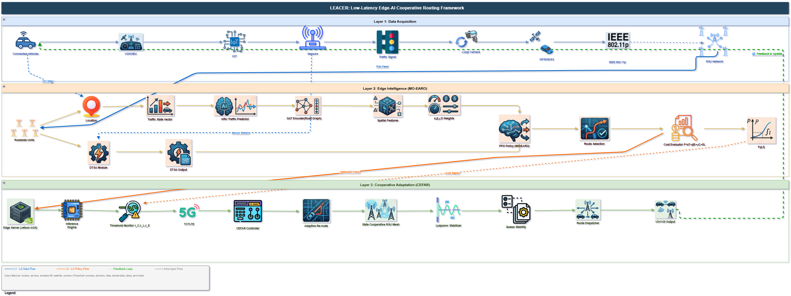

# LEACER: Lightweight Edge-AI Cooperative Event-triggered Re-routing

**LEACER** is a multi-layered Edge-AI traffic management and vehicle routing framework designed for the **SUMO (Simulation of Urban MObility)** environment. It optimizes urban traffic flow, reduces energy consumption (CO₂ emissions), and ensures system stability using a combination of Graph Attention Networks (GAT), Deep Reinforcement Learning (PPO), and Lyapunov Stability theory.

## 🚀 Key Features

*   **Layer 1: Dynamic Traffic State Analyzer (DTSA)** — Real-time data acquisition and fusion from RSUs, vehicle OBUs, and IoT sensors to generate high-fidelity Traffic State Vectors (TSVs).
*   **Layer 2: Multi-Objective Edge-AI Route Optimizer (MO-EARO)** — Uses GAT for road graph embeddings and PPO to compute Pareto-optimal routes balancing travel time, energy, congestion, and latency.
*   **Layer 3: Cooperative Event-triggered Fault-Adaptive Re-routing (CEFAR)** — A robust adaptation layer that monitors KPIs and triggers re-routing during congestion or failures while maintaining queue stability via Lyapunov drift-plus-penalty constraints.
*   **Comprehensive Benchmark Suite** — Full simulation pipeline comparing LEACER against 6 classical and AI baselines (**Dijkstra, A*, Static, Cloud-DQN, GCN-Route, and MARL**) with detailed telemetry tracking (CO₂, Speed, Queue Length, Latency).
*   **Predictive Analytics** — Includes a GRU-based predictor for short-term traffic forecasting.

## 📊 Performance Visualization

The framework generates 12 detailed IEEE-standard comparison plots, including:
*   Cumulative CO₂ Emissions (Fig. 4)
*   Average Network Speed (Fig. 1)
*   Queue Length Distribution (Fig. 6)
*   KPI Radar Charts (Fig. 8)
*   Latency CDF & Throughput (Fig. 10 & 11)
*   Lyapunov Drift & Stability Analysis (Fig. 12)

## 🛠️ Installation & Setup

### Prerequisites
*   Python 3.8+
*   [SUMO (Simulation of Urban MObility)](https://sumo.dlr.de/docs/Installing/index.html)
*   `traci`, `sumolib`, `numpy`, `pandas`, `matplotlib`, `torch`

### Quick Start

1.  **Train the Intelligence Layer & AI Baselines (Optional):**
    ```bash
    # Train Traffic Predictor & PPO Policy
    python simulation/train_gru.py
    python simulation/train_ppo.py --episodes 100

    # Train Baseline Models (DQN, MARL, GCN)
    python simulation/baseline_dqn.py --mode train --episodes 400
    python simulation/baseline_marl.py --mode train --episodes 300
    python simulation/baseline_gcn.py --mode train --epochs 60
    ```

2.  **Run Master Comparison Pipeline (Runs LEACER + All 6 Baselines):**
    ```bash
    # Run complete end-to-end evaluation & regenerate all 12 IEEE plots
    python simulation/run_all_comparison.py --steps 3600
    ```

3.  **Run Single Simulation with GUI Visualization:**
    ```bash
    python simulation/run_simulation.py --mode leacer --steps 3600 --gui
    ```

### Results & Output Directory
*   **KPI Summaries:** `simulation/results/leacer_run_summary.json`, `simulation/results/kpi_summary.csv`
*   **Telemetry Data:** `simulation/results/*_telemetry.csv` (Git-ignored)
*   **Generated Plots:** `simulation/results/plots/*.pdf` & `.png` (Git-ignored)
*   **Trained Models:** `simulation/data/*.pt`
*   **Architecture Diagram:** `LEACER.drawio`

## 📂 Data & Results Access

All generated simulation telemetry, CSV logs, XML outputs, and plot PDFs are generated locally in `simulation/results/` and `simulation/results/plots/`. 

To maintain a lightweight repository, generated results, raw telemetry CSVs, and output graphs are excluded from Git tracking. You can regenerate all telemetry and figures at any time using:

```bash
# Evaluate and plot stored telemetry data
python simulation/results_analyzer.py
```

## 📖 Research Paper
The technical details, mathematical formulations, and experimental results of the LEACER framework are documented in the following research paper:

*   **View on Overleaf:** [LEACER: Lightweight Edge-AI Cooperative Event-triggered Re-routing](https://www.overleaf.com/read/mstksgzdtkzm#c00324)

## 📂 Framework Architecture



1.  **Data Layer:** RSU Aggregator + IoT Fusion
2.  **Intelligence Layer:** GAT Encoder + PPO Policy
3.  **Control Layer:** CEFAR Trigger + Lyapunov Stabilizer

---
*Developed for research in Intelligent Transportation Systems (ITS) and Edge-AI.*

