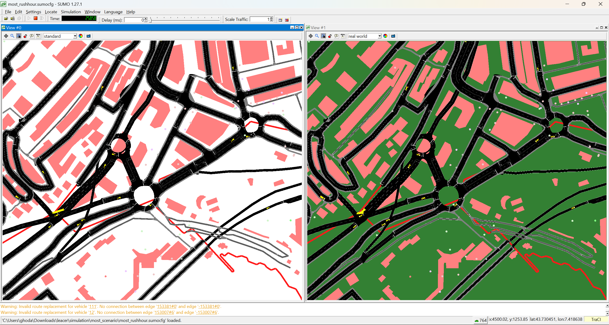
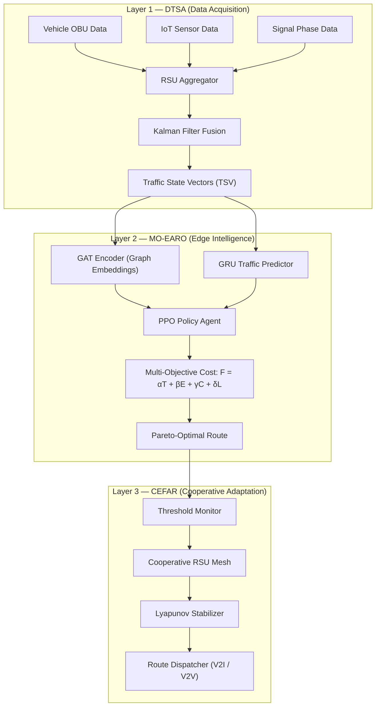

# LEACER: Lightweight Edge-AI Cooperative Event-triggered Re-routing

**LEACER** is a multi-layered Edge-AI traffic management and vehicle routing framework designed for the **SUMO (Simulation of Urban MObility)** environment. It optimizes urban traffic flow, reduces energy consumption (CO₂ emissions), and ensures system stability using a combination of Graph Attention Networks (GAT), Deep Reinforcement Learning (PPO), and Lyapunov Stability theory.

## 🚀 Key Features

*   **Layer 1: Dynamic Traffic State Analyzer (DTSA)** — Real-time data acquisition and fusion from RSUs, vehicle OBUs, and IoT sensors to generate high-fidelity Traffic State Vectors (TSVs).
*   **Layer 2: Multi-Objective Edge-AI Route Optimizer (MO-EARO)** — Uses GAT for road graph embeddings and PPO to compute Pareto-optimal routes balancing travel time, energy, congestion, and latency.
*   **Layer 3: Cooperative Event-triggered Fault-Adaptive Re-routing (CEFAR)** — A robust adaptation layer that monitors KPIs and triggers re-routing during congestion or failures while maintaining queue stability via Lyapunov drift-plus-penalty constraints.
*   **Realistic Urban Benchmark (MoST)** — Evaluated on the realistic **Monaco SUMO Traffic (MoST)** scenario featuring 2,004 junctions, 4,404 road edges, and 7,200 simulation steps of morning rush-hour congestion.
*   **Physics-Valid Edge Routing (`G_edge`)** — Dual-layer junction and edge connection graph enforcing strict lane connectivity and passenger class permissions (`getAllowedOutgoing('passenger')`), completely eliminating invalid route replacements, U-turns, and vehicle teleports.
*   **Comprehensive Benchmark Suite** — Full simulation pipeline comparing LEACER against 6 classical and AI baselines (**Dijkstra, A*, Static, Cloud-DQN, GCN-Route, and MARL**) with identical telemetry tracking (CO₂, Speed, Queue Length, Latency).
*   **Predictive Analytics** — Includes a GRU-based predictor for short-term traffic forecasting.

---

## 🚦 Realistic Urban Simulation: Monaco (MoST) Scenario



The LEACER framework is evaluated on the realistic, open-source **Monaco SUMO Traffic (MoST)** scenario:
*   **Real-World Complex Network**: Spans 2.5 km² of the Principality of Monaco, featuring 2,004 junctions, 4,404 road edges, multi-level ramps, tunnels, and 6,187 physically valid lane connections.
*   **Realistic AM Peak Demand**: 7,200 simulation seconds (25,200s to 32,400s / 07:00–09:00 AM) replicating morning rush-hour commuting patterns across Monaco.
*   **Heterogeneous Vehicle Classes**: Incorporates multi-modal traffic distributions (passenger cars, taxis, delivery vans, buses, emergency vehicles, motorcycles).
*   **Physics-Valid Edge Routing (`G_edge`)**: To prevent unrealistic routing decisions on complex urban topologies, LEACER implements dual-layer graph routing with strict turn restrictions and passenger permissions (`getAllowedOutgoing('passenger')`), completely eliminating illegal turns, cycle/footpath intrusions, and artificial SUMO vehicle teleports.

---

## 📊 Performance Visualization

The framework generates 12 detailed IEEE-standard comparison plots:
*   Average Network Speed over Time (Fig. 1)
*   Average Queue Length over Time (Fig. 2)
*   Decision Offloading Latency vs CEFAR Threshold $\tau_L = 150$ ms (Fig. 3)
*   Cumulative Vehicular CO₂ Emissions over Time (Fig. 4)
*   Speed Distribution Comparison across Algorithms (Fig. 5)
*   Queue Length Distribution Comparison (Fig. 6)
*   Rush Hour Speed & Queue Dual-Panel Profile (Fig. 7)
*   Normalized 5-Axis KPI Radar Chart (Fig. 8)
*   LEACER Improvement over Baselines (Fig. 9)
*   Latency CDF Comparison against $\tau_L = 150$ ms (Fig. 10)
*   Dynamic Network Throughput over Time (Fig. 11)
*   Lyapunov Drift Stability Analysis $\mathcal{V}(Q) = \frac{1}{2}Q^2$ (Fig. 12)

---

## 🛠️ Installation & Setup

### Prerequisites
*   Python 3.8+
*   [SUMO (Simulation of Urban MObility)](https://sumo.dlr.de/docs/Installing/index.html) — `SUMO_HOME` environment variable configured
*   `traci`, `sumolib`, `numpy`, `pandas`, `matplotlib`, `torch`

```bash
# Clone the repository
git clone https://github.com/naman1326/leacer.git
cd leacer

# Install required Python dependencies
pip install torch numpy pandas matplotlib scipy
```

### Quick Start

1.  **Run Master Comparison Pipeline (Runs LEACER + All 6 Baselines):**
    ```bash
    cd simulation
    # Run full 7,200-step rush-hour benchmark using pre-trained weights
    python run_all_comparison.py --steps 7200 --skip-training
    ```
    *(Add `--gui` to visually observe the vehicles and routing maneuvers in the SUMO GUI).*

2.  **Run Single Simulation Mode:**
    ```bash
    cd simulation
    python run_simulation.py --mode leacer --steps 7200 --gui
    ```

3.  **Train the Intelligence Layer & AI Baselines (Optional):**
    ```bash
    cd simulation
    # Train GRU Traffic Predictor & PPO Policy
    python train_gru.py
    python train_ppo.py --episodes 400

    # Train Baseline Models (DQN, MARL, GCN)
    python baseline_dqn.py --mode train --episodes 400
    python baseline_marl.py --mode train --episodes 300
    python baseline_gcn.py --mode train --rollout-steps 400 --epochs 60
    ```

### 🎛️ Scenario Configuration (Single Source of Truth)

All runners, baseline evaluators, and training scripts dynamically import their network topology and configuration paths from [`simulation/scenario_config.py`](simulation/scenario_config.py):
*   `_ACTIVE = "most"` (Default): High-density Monaco rush-hour scenario (`most_rushhour.sumocfg`, `most.net.xml`).
*   `_ACTIVE = "grid"`: 13-junction synthetic grid network (`leacer.sumocfg`, `leacer_network.net.xml`).

Switching scenarios takes a single edit in `scenario_config.py`.

---

## 📂 Data & Results Access

All generated simulation telemetry, CSV logs, XML outputs, and plot PDFs are generated locally in `simulation/results/` and `simulation/results/plots/`. 

To regenerate all telemetry and figures at any time:

```bash
cd simulation
python results_analyzer.py
```

*   **KPI Summaries:** `simulation/results/leacer_run_summary.json`, `simulation/results/kpi_summary.csv`
*   **Telemetry Data:** `simulation/results/*_telemetry.csv`
*   **Generated Plots:** `simulation/results/plots/*.pdf` & `.png`
*   **Trained Models:** `simulation/data/*.pt`
*   **Architecture Diagram:** `LEACER.drawio`

---

## 📖 Research Paper
The technical details, mathematical formulations, and experimental results of the LEACER framework are documented in the following research paper:

*   **View on Overleaf:** [LEACER: Lightweight Edge-AI Cooperative Event-triggered Re-routing](https://www.overleaf.com/read/mstksgzdtkzm#c00324)

---

## 📐 Three-Layer Architecture




| Layer | Module | Purpose | Source |
|-------|--------|---------|--------|
| **1** | **DTSA** — Dynamic Traffic State Analyzer | Fuses V2X OBU, IoT sensor, and signal-phase data via Kalman filtering into per-edge Traffic State Vectors `{S, D, Q, L}` | `dtsa.py` |
| **2** | **GAT Encoder** | Encodes road-network graph `G=(V,E)` into spatial node embeddings using multi-head Graph Attention | `gat_encoder.py` |
| **2** | **GRU Predictor** | Short-term traffic forecasting over a look-back window of TSVs | `gru_predictor.py` |
| **2** | **MO-EARO** — Multi-Objective Route Optimizer | PPO actor-critic selects Pareto-optimal routes minimizing `F = 0.35·T + 0.25·E + 0.25·C + 0.15·L` | `mo_earo.py` |
| **3** | **CEFAR** — Cooperative Event-triggered Fault-Adaptive Re-routing | Monitors KPIs against thresholds, fuses cooperative RSU mesh states, enforces queue stability via Lyapunov drift-plus-penalty, and dispatches re-routing events | `cefar.py` |

---

## 🔧 Tech Stack

| Component | Technology |
|-----------|-----------|
| Language | Python 3.8+ |
| Deep Learning | PyTorch (with NumPy fallbacks for all neural modules) |
| Traffic Simulator | SUMO via `traci` / `sumolib` |
| Core Algorithms | GAT, PPO (Actor-Critic), GRU (Seq2Seq), Kalman Filter, Lyapunov Stability |
| Visualization | Matplotlib (12 IEEE-standard comparison plots) |
| Data Processing | NumPy, Pandas |

---

## 📁 File Structure

```
leacer/
├── config.py                  # All hyperparameters & thresholds
├── dtsa.py                    # Layer 1: Traffic State Aggregator (Kalman fusion)
├── gat_encoder.py             # Layer 2: GAT graph encoder (PyTorch + NumPy fallback)
├── gru_predictor.py           # Layer 2: GRU traffic forecaster (PyTorch + NumPy fallback)
├── mo_earo.py                 # Layer 2: PPO actor-critic + MO cost evaluator
├── cefar.py                   # Layer 3: CEFAR controller + Lyapunov stabilizer
├── run_leacer.py              # Standalone single-cycle pipeline demo
├── LEACER.drawio              # Architecture diagram (draw.io)
├── leacer_ss.png              # Architecture overview diagram
│
├── data/
│   └── sumo-gui-ss.png        # SUMO GUI simulation view
│
└── simulation/
    ├── scenario_config.py       # Single source of truth for active scenario (MoST vs grid)
    ├── topology_cache.py        # Precomputed network topology & adjacency
    ├── topology_loader.py       # Network topology extractor and cache builder
    ├── sumo_env.py              # SUMO environment wrapper (traci)
    ├── sumo_data_adapter.py     # Bridges SUMO ↔ LEACER data structures
    ├── multi_rsu.py             # Multi-RSU simulation with cooperative mesh
    ├── routing_utils.py         # Dual-graph routing (G & G_edge) with passenger validation
    ├── leacer_runner.py         # Full LEACER closed-loop simulation runner
    ├── run_simulation.py        # CLI entry point: single-mode simulation (--gui)
    ├── run_all_comparison.py    # CLI entry point: LEACER + 6 baselines end-to-end
    ├── results_analyzer.py      # Post-hoc analysis & 12 IEEE-standard plot generation
    │
    ├── train_gru.py             # GRU traffic predictor training script
    ├── train_ppo.py             # PPO routing agent training script
    ├── baseline_classical.py    # Dijkstra / A* / Static baselines
    ├── baseline_dqn.py          # Cloud-DQN baseline (5-action output)
    ├── baseline_gcn.py          # GCN-Route baseline
    ├── baseline_marl.py         # Independent MARL baseline (4 regional agents)
    ├── baseline_runner.py       # Unified baseline execution harness
    │
    ├── most_scenario/           # Monaco SUMO Traffic (MoST) rush-hour scenario
    │   ├── most_rushhour.sumocfg# MoST SUMO simulation configuration
    │   ├── in/                  # Road network (most.net.xml), polygons & routes
    │   └── generate_demand.py   # Demand generation helper
    │
    ├── sumo_cfg/                # Synthetic grid network, routes, config files
    ├── data/                    # Pre-trained model weights (.pt) + training normalizers
    └── results/                 # Telemetry CSVs, SUMO XMLs, KPI summaries, plots/
```

---

## 🏁 Benchmarked Baselines (6 Total)

LEACER is evaluated against 3 classical and 3 AI-based routing baselines:

| # | Baseline | Type | Description | Source |
|---|----------|------|-------------|--------|
| 1 | **Dijkstra** | Classical | Shortest-path by dynamic edge travel time | `simulation/baseline_classical.py` |
| 2 | **A*** | Classical | Heuristic-guided shortest-path | `simulation/baseline_classical.py` |
| 3 | **Static** | Classical | Fixed pre-computed routes (no adaptation) | `simulation/baseline_classical.py` |
| 4 | **Cloud-DQN** | AI (Centralized) | Deep Q-Network with cloud latency penalty | `simulation/baseline_dqn.py` |
| 5 | **GCN-Route** | AI (Graph) | Graph Convolutional Network predicting edge desirability | `simulation/baseline_gcn.py` |
| 6 | **MARL** | AI (Multi-Agent) | Independent Multi-Agent Reinforcement Learning across 4 regions | `simulation/baseline_marl.py` |

---
*Developed for research in Intelligent Transportation Systems (ITS) and Edge-AI.*
